# Health Interpretable Time Series (ECG)

This project classifies 12‑lead ECG recordings from the PTB‑XL dataset into 5 diagnostic classes and explains the decision. The final model (InterpGN v10) combines an interpretable shapelet model with a ResNet1d classifier and a gate that decides which expert to trust.

## What this project does

- Classifies ECGs into: **NORM**, **MI**, **STTC**, **CD**, **HYP**
- Uses a hybrid model for accuracy and interpretability
- Produces visual explanations and summary plots (see `outputs_v10/`)

## Dataset (PTB‑XL)

- 21,837 ECG recordings
- 12 leads (I, II, III, aVR, aVL, aVF, V1–V6)
- 10‑second recordings, stored at 100 Hz or 500 Hz
- 5 classes:
  - **NORM**: Normal
  - **MI**: Myocardial infarction
  - **STTC**: ST/T changes
  - **CD**: Conduction disturbance
  - **HYP**: Hypertrophy
- Official PTB‑XL folds are used (train/val/test = 8/1/1)

Data is expected under:

- `data/ptb-xl-a-large-publicly-available-electrocardiography-dataset-1.0.3/`

## Model used for classification (InterpGN v10)

We start with two models and then combine them:

1. **SBM (Shapelet‑Based Model)**
   - Learns short waveform patterns (shapelets)
   - Easy to interpret but limited in accuracy

2. **ResNet1d**
   - Deep CNN for time series
   - Strong accuracy but hard to interpret

**InterpGN v10** combines both with a **Gini gate**:

- If the SBM is confident (high $\eta$), use SBM
- If SBM is not confident (low $\eta$), use ResNet1d

Training is done in 3 phases:

- Phase 0: train SBM only
- Phase 0b: train ResNet1d only
- Phase 1: joint training with a beta schedule and OneCycleLR

We also handle class imbalance with **FocalLoss** and **WeightedSampler**.

## Results (v10 run at 100 Hz)

These numbers come from `notebook/health_interpretable_v10.ipynb`:

| Metric                 | Value  |
| ---------------------- | ------ |
| Test Accuracy          | 0.6524 |
| Balanced Test Accuracy | 0.5989 |
| Macro AUC (OvR)        | 0.8649 |

Gate routing in this run:

- **2.5%** of samples routed to the interpretable expert (SBM) with $\eta > 0.5$
- The rest used the ResNet1d expert

Per‑class ROC AUC (from the plot):

- NORM: 0.911
- MI: 0.879
- STTC: 0.901
- CD: 0.863
- HYP: 0.770

Per‑class Average Precision (from the PR plot):

- NORM: 0.873
- MI: 0.681
- STTC: 0.630
- CD: 0.664
- HYP: 0.175

## Plots (v10) — explanation + image

All images are in `outputs_v10/`. For each figure, the text explains what the axes and colors mean, then the image is shown.

### Class distribution (`03_class_distribution.png`)

- **X‑axis**: class name
- **Y‑axis**: number of samples
- Colors follow the class palette used in the notebook
- Shows train/val/test split; largest class is ~44% in each split

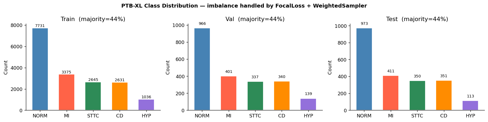

### Training curves (`06_training_curves.png`)

Top row:

- **Losses**: blue = total hybrid loss, orange = SBM loss, green = joint classification loss
- **Validation accuracy**: green = val accuracy, dashed red = balanced accuracy, dotted line = best epoch
- **Gini gate mean**: purple line, dashed red = threshold 0.5

Bottom row:

- **% routed to SBM**: orange line, percentage of samples with $\eta > 0.5$
- **Gradient norms**: blue = SBM, red = ResNet1d
- **Beta schedule**: gray line from 0 to 1

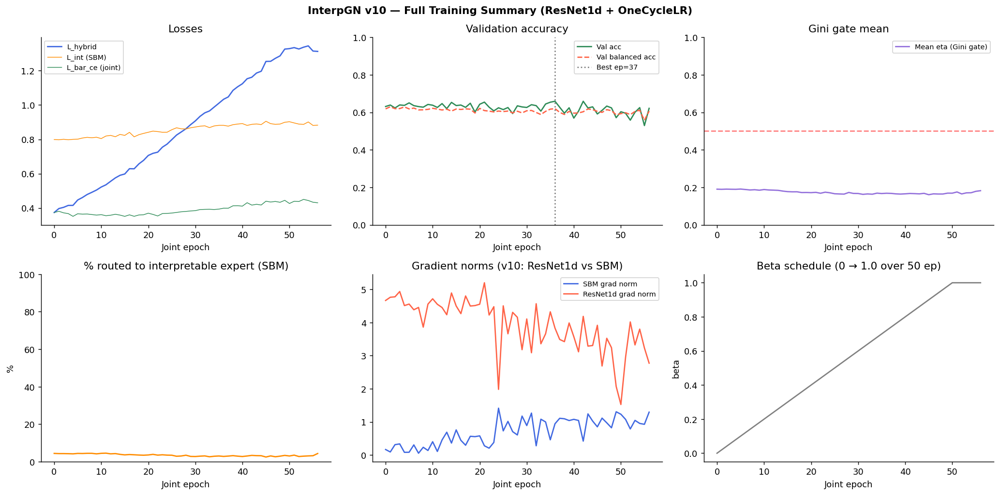

### Confusion matrix (`07_confusion_matrix.png`)

- **Left**: raw counts (blue)
- **Right**: row‑normalized percentages (yellow‑red)
- **X‑axis**: predicted class, **Y‑axis**: true class

Diagonal (correct) rates from this run:

- NORM: 72% (697 correct)
- MI: 55% (225 correct)
- STTC: 63% (219 correct)
- CD: 71% (248 correct)
- HYP: 40% (45 correct)

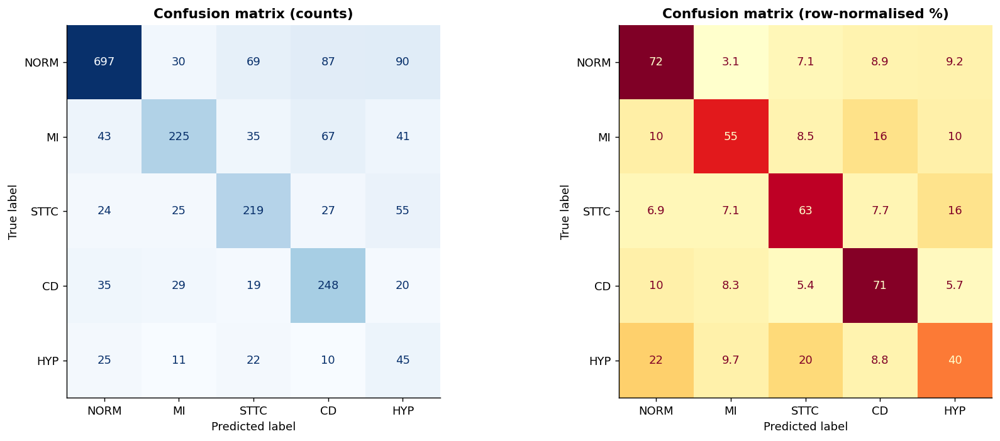

### ROC curves (`07_roc_curves.png`)

- **X‑axis**: false positive rate (FPR)
- **Y‑axis**: true positive rate (TPR)
- Dashed diagonal = random classifier
- Each panel is one class; legend shows AUC

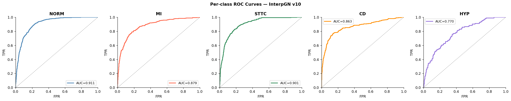

### Precision‑Recall curves (`07_pr_curves.png`)

- **X‑axis**: recall
- **Y‑axis**: precision
- Each panel is one class; legend shows AP

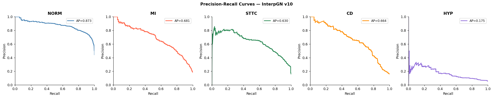

### Gini gate analysis (`07_gate_analysis.png`)

- **Left**: histogram of $\eta$ (gate value). Red dashed line = threshold 0.5
- **Right**: per‑class $\eta$ distributions; legend shows median values
- In this run most $\eta$ values are below 0.5, so the ResNet expert is used more often

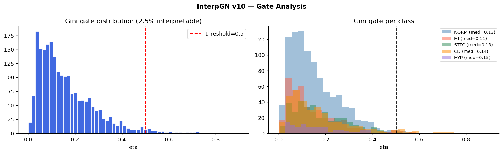

### Shapelet gallery (`08a_shapelet_gallery.png`)

- Each small plot is a learned shapelet (a short ECG pattern)
- **Rows** = scale (length L = 50, 100, 200, 300, 500, 800)
- **Columns** = shapelet index S1–S10
- Colors are only for separation, not classes

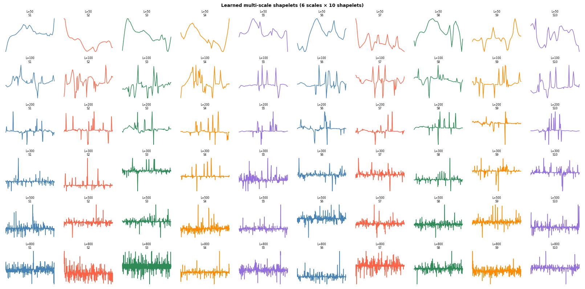

### SBM classifier weights (`08a_importance_heatmap.png`)

- **Rows**: classes
- **Columns**: shapelet feature index
- **Blue**: presence of a feature supports that class
- **Red**: absence of a feature supports that class
- Values are row‑normalized between −1 and 1

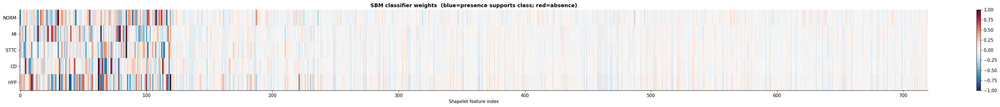

### SBM instance explanations (`08a_instance_explanations.png`)

- Top of each pair: full ECG signal
  - **Orange window** = best matching location for a shapelet
- Bottom of each pair: zoomed window vs learned shapelet
  - **Orange** = ECG window
  - **Blue dashed** = shapelet
  - $d^2$ shows the match distance (lower is better)

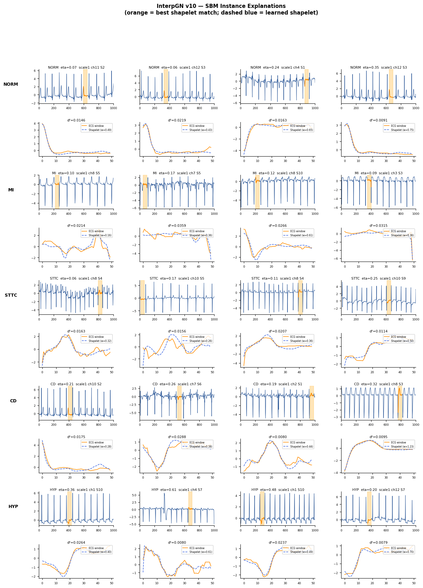

### Grad‑CAM saliency (`08b_gradcam.png`)

- Black line = ECG signal
- Red background = time points that most influenced the ResNet1d prediction
- Shows leads II, aVF, V1, V2
- Title shows true class, predicted class, and $\eta$

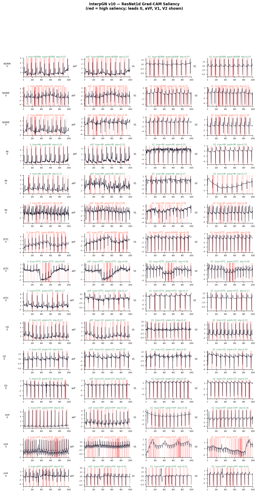

### Lead importance (`08c_lead_importance.png`)

- **X‑axis**: ECG leads
- **Y‑axis**: classes
- Color shows mean absolute gradient (row‑normalized)
- `#1`, `#2`, `#3` mark the top 3 leads for each class

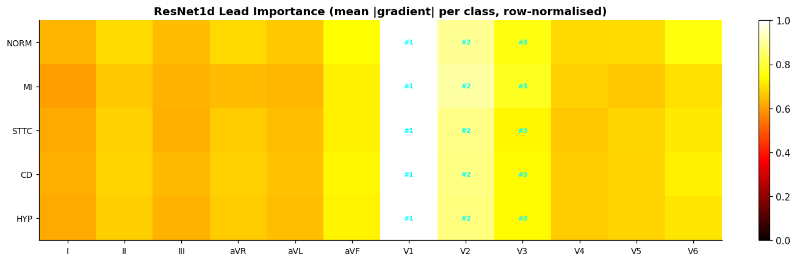

## Model files

- `outputs_v10/interpgn_v10_best.pt` — best joint model
- `outputs_v10/resnet_pretrain_best.pt` — ResNet1d pretrain checkpoint

## How to run

- Open `notebook/health_interpretable_v10.ipynb`
- Make sure PTB‑XL data is in `data/ptb-xl-a-large-publicly-available-electrocardiography-dataset-1.0.3/`
- Check `FREQ_HZ` in the notebook if you want 100 Hz or 500 Hz

That is the full v10 run and its plots. If you want to add older version results, share those numbers and I can add them.
